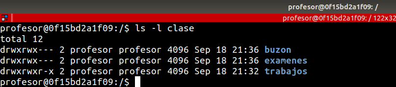
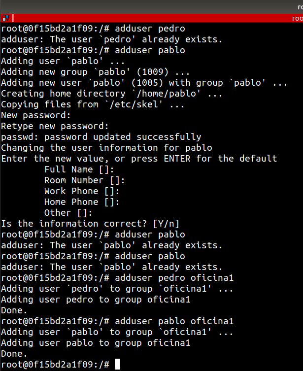
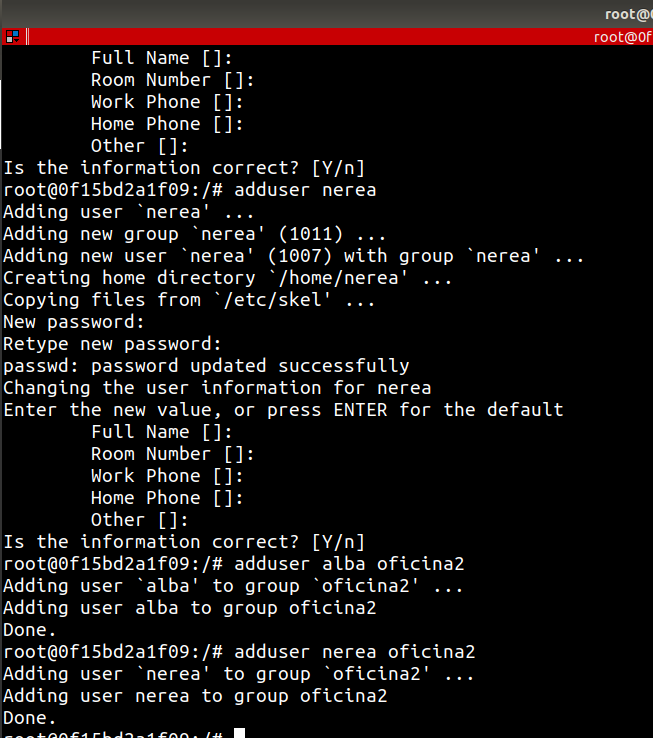
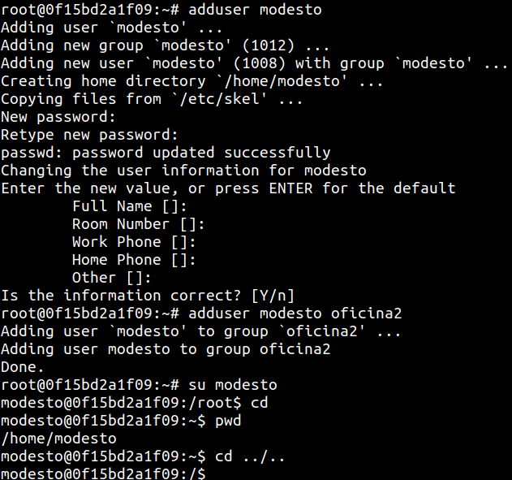

# EJERCICIO Y EJEMPLOS DE PERMISOS GNU / LINUX

## Requerimientos

Los ejercicios se realizaron dentro de un contenedor de ubuntu para evitar crear usuarios en la maquina anfitriona

1. Crea un contenedor con la imagen de ubuntu
```bash
docker run -d --name ejercicio_permisos -it ubuntu:20.04
```

2. Con el contenedor en ejecución, entramos al contenedor para poder realizar los ejercicios.
```bash
docker exec -it ejercicio_permisos /bin/bash
```

## Ejercicios pagina Codifica

https://www.codifica.me/ejercicio-y-ejemplos-de-permisos-gnu-linux/

### 1. Creación con root del directorio clase

```bash
su
cd /
mkdir clase
chmod 777 clase
```

### 2. Creación de usuarios y grupos 

```bash
adduser profesor

adduser alumno1
adduser alumno2
adduser alumno3
```

Crear de grupos: "alumnos" y "profesores".
```bash
addgroup alumnos

addgroup profesores
```

Asignar grupos a cada usuario
```bash
usermod -a -G alumnos alumno1
usermod -a -G alumnos alumno2
usermod -a -G alumnos alumno3

usermod -a -G profesores profesor
```

### 3. Creación de carpetas con el usuario profesor 

```bash
su profesor
```


Para el directorio trabajos asignamos todos los permisos (4+2+1) al propietario y al grupo, mientras que lectura y ejecución al resto de usuarios (4+1)

```bash
mkdir clase/trabajos
chmod 775 clase/trabajos
ls -l clase
```

Para el directorio examenes asignamos todos los permisos para propietario y grupo (4+2+1) y ningún permiso para el resto de usuarios (0)

```bash
mkdir clase/examenes
chmod 770 clase/examenes
ls -l clase
```

Para el directorio buzon asignamos todos los permisos para todos los usuarios (4+2+1)
```bash
mkdir clase/buzon
chmod 770 clase/buzon
ls -l clase
```




### 4. Creación de archivos con el usuario profesor 

```bash
touch clase/trabajos/tarea1.txt
touch clase/examenes/junio.txt
touch clase/buzon/enlaces.txt
```


### 5. Comprobando permisos con el usuario alumno

#### 5.1 Para el directorio de trabajos

```bash
su alumno1

head clase/trabajos/tarea1.txt

# Esto nos debe dar un error de permiso denegado
echo escribiendo > clase/trabajos/tarea1.txt
```


#### 5.2 Para el directorio de examenes

```bash
# Esto nos debe dar un error de permiso denegado
head clase/examenes/junio.txt

# Esto nos debe dar un error de permiso denegado
echo escribiendo > clase/examenes/junio.txt
```


#### 5.3 Para el directorio de buzon

```bash
cat clase/buzon/enlaces.txt
echo escribiendo > clase/buzon/enlaces.txt
# Esto nos debe dar un error de permiso denegado
touch clase/buzon/ejemplos.txt
```


# Ejercicios documento PDF

1. Crea los grupos oficina1 y oficina2.

```bash
addgroup oficina1
addgroup oficina2
```


2. Crea los usuarios pedro y pablo. Estos usuarios deben pertenecer únicamente al grupo oficina1.
```bash
adduser pedro
adduser pablo
adduser pedro oficina1
adduser pablo oficina1
```




3. Crea los usuarios alba y nerea. Estos usuarios deben pertenecer únicamente al
grupo oficina2.

```bash
adduser alba
adduser nerea
adduser alba oficina2
adduser nerea oficina2
```




4. Como usuario pedro Crea un fichero con nombre topsecret.txt al que únicamente él tenga acceso, tanto de lectura como de escritura.
```bash
cd home/pedro
echo mensaje_secreto > topsecret.txt
chmod 600 topsecret.txt
```


5. Crea otro fichero, también como usuario pedro, con nombre ventas_trimestre.txt al que tengan acceso, tanto para leer como para escribir todos los usuarios que pertenezcan al mismo grupo. Comprueba como usuario pablo que puedes modificar el fichero.

```bash
su alba
cat > ventas_trimestre.txt
chmod 660 ventas_trimestre.txt
```


6. Como usuario alba, crea un fichero con nombre empleados.txt al que pueda acceder
cualquier usuario para leer su contenido, y cualquier usuario del mismo grupo para
leer o escribir .

```bash
su alba
cat > empleados.txt
chmod 764 empleados.txt
```


7 . Copia el fichero empleados.txt al directorio de trabajo de alumno. Cambia el propietario y el grupo al que pertenece el fichero, ahora debe ser alumno.

```bash
cp empleados.txt /home/pc4
chown pc4 empleados.txt
chgrp pc4 empleados.txt
```


8. Como usuario pablo, copia un programa del directorio /usr/bin al directorio de trabajo con un nombre
diferente. Por ejemplo kalarm se puede copiar como alarma. Mira los permisos de este programa. Comprueba que se puede ejecutar.

```bash
cp /usr/bin/zdump /home/pablo/zetadump
ls –l
```

9. Cambia los permisos de alarma de tal f orma que sólo lo pueda ejecutar el propietario del archivo.
```bash
chmod 744 /home/pablo/zetadump
```

10.Crea el usuario modesto, perteneciente a oficina2. Dentro de su directorio de trabajo, crea un directorio de nombre compartido_con_todos.
```bash
adduser modesto
adduser modesto oficina2
su modesto
cd ../..
Mkdir compartido_con_todos
```

