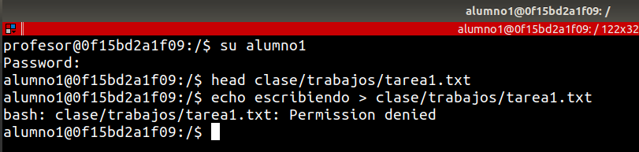
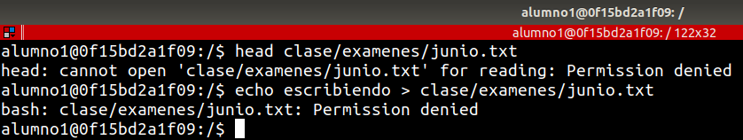
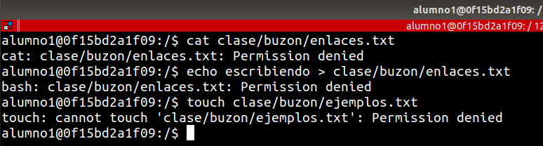

# EJERCICIO Y EJEMPLOS DE PERMISOS GNU / LINUX

## Requerimientos

Los ejercicios se realizaron dentro de un contenedor de ubuntu para evitar crear usuarios en la maquina anfitriona

1. Crea un contenedor con la imagen de ubuntu
```bash
docker run -d --name ejercicio_permisos -it ubuntu:20.04
```

2. Con el contenedor en ejecución, entramos al contenedor para poder realizar los ejercicios.
```bash
docker exec -it ejercicio_permisos /bin/bash
```

## Ejercicios

### 1. Creación con root del directorio clase

```bash
su
cd /
mkdir clase
chmod 777 clase
```

### 2. Creación de usuarios y grupos 

```bash
adduser profesor

adduser alumno1
adduser alumno2
adduser alumno3
```

Crear de grupos: "alumnos" y "profesores".
```bash
addgroup alumnos

addgroup profesores
```

Asignar grupos a cada usuario
```bash
usermod -a -G alumnos alumno1
usermod -a -G alumnos alumno2
usermod -a -G alumnos alumno3

usermod -a -G profesores profesor
```

### 3. Creación de carpetas con el usuario profesor 

```bash
su profesor
```


Para el directorio trabajos asignamos todos los permisos (4+2+1) al propietario y al grupo, mientras que lectura y ejecución al resto de usuarios (4+1)

```bash
mkdir clase/trabajos
chmod 775 clase/trabajos
ls -l clase
```

Para el directorio examenes asignamos todos los permisos para propietario y grupo (4+2+1) y ningún permiso para el resto de usuarios (0)

```bash
mkdir clase/examenes
chmod 770 clase/examenes
ls -l clase
```

Para el directorio buzon asignamos todos los permisos para todos los usuarios (4+2+1)
```bash
mkdir clase/buzon
chmod 770 clase/buzon
ls -l clase
```


### 4. Creación de archivos con el usuario profesor 

```bash
touch clase/trabajos/tarea1.txt
touch clase/examenes/junio.txt
touch clase/buzon/enlaces.txt
```


### 5. Comprobando permisos con el usuario alumno

#### 5.1 Para el directorio de trabajos

```bash
su alumno1

head clase/trabajos/tarea1.txt

# Esto nos debe dar un error de permiso denegado
echo escribiendo > clase/trabajos/tarea1.txt
```




#### 5.2 Para el directorio de examenes

```bash
# Esto nos debe dar un error de permiso denegado
head clase/examenes/junio.txt

# Esto nos debe dar un error de permiso denegado
echo escribiendo > clase/examenes/junio.txt
```



#### 5.3 Para el directorio de buzon

```bash
cat clase/buzon/enlaces.txt
echo escribiendo > clase/buzon/enlaces.txt
# Esto nos debe dar un error de permiso denegado
touch clase/buzon/ejemplos.txt
```



